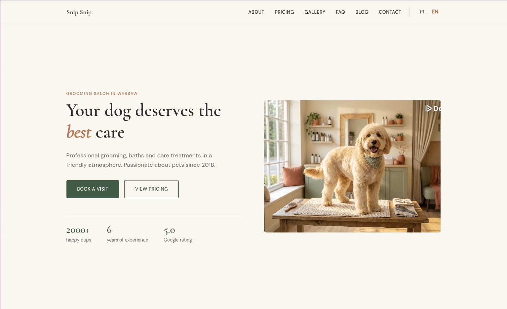

# Localcraft

A Hugo theme for small local service businesses — hairdressers, beauty salons, massage parlors, pet groomers, and more.



## Features

- Organic warm minimalism design
- Fully responsive (mobile-first)
- Multi-language support (i18n)
- SEO optimized (JSON-LD, Open Graph, Twitter Cards)
- No JavaScript frameworks — vanilla JS only
- Leaflet.js integration for location maps
- Before/after image slider for galleries
- Configurable sections via front matter

## Requirements

- Hugo **0.123.0** or higher (extended version recommended)

## Installation

### Option 1: Git Submodule

```bash
git submodule add https://github.com/maciejkosiarski/localcraft.git themes/localcraft
```

### Option 2: Hugo Modules

Add to your `hugo.yaml`:

```yaml
module:
  imports:
    - path: github.com/maciejkosiarski/localcraft
```

Then run:

```bash
hugo mod get -u
```

### Option 3: Download

Download the theme and extract it to `themes/localcraft`.

## Configuration

Add to your `hugo.yaml`:

```yaml
theme: localcraft

languages:
  en:
    languageName: English
    languageCode: en-US
    contentDir: content/en
    title: "Your Business Name"
    weight: 1

params:
  logo:
    name: "Your Business"
    dot: true  # adds decorative dot after name

  business:
    name: "Your Business Name"
    type: "HairSalon"  # Schema.org type: HairSalon, BeautySalon, DaySpa, PetGroomer, HealthAndBeautyBusiness
    phone: "+1 234 567 890"
    email: "hello@example.com"
    street: "123 Main Street"
    city: "New York"
    postalCode: "10001"
    country: "US"
    lat: 40.7128
    lng: -74.0060
    start_year: 2020

  og_image: "/images/og-default.jpg"

  footer:
    description: "Your tagline here"
    social:
      - name: "Facebook"
        url: "https://facebook.com/yourbusiness"
      - name: "Instagram"
        url: "https://instagram.com/yourbusiness"
```

## Data Files

The theme uses YAML data files for dynamic content. Create these in your `data/{lang}/` directory:

### `data/en/services.yaml`
```yaml
- name: "Haircut"
  description: "Professional haircut service"
  price: "$30"
  icon: "scissors"

- name: "Styling"
  description: "Hair styling and treatment"
  price: "$50"
  icon: "hand"
```

### `data/en/testimonials.yaml`
```yaml
- name: "Jane Doe"
  rating: 5
  quote: "Amazing service! Highly recommended."
  detail: "Regular customer"
```

### `data/en/team.yaml`
```yaml
- name: "John Smith"
  role: "Senior Stylist"
  bio: "10 years of experience..."
  image: "/images/team/john.jpg"
```

### `data/en/faq.yaml`
```yaml
- question: "Do I need an appointment?"
  answer: "Yes, we recommend booking in advance."

- question: "What payment methods do you accept?"
  answer: "Cash, credit cards, and mobile payments."
```

### `data/en/pricing.yaml`
```yaml
categories:
  - name: "Haircuts"
    services:
      - name: "Men's Haircut"
        duration: "30 min"
        price: "$25"
      - name: "Women's Haircut"
        duration: "45 min"
        price: "$40"
```

### `data/en/opening_hours.yaml`
```yaml
- day: "Monday"
  open: "09:00"
  close: "18:00"
- day: "Tuesday"
  open: "09:00"
  close: "18:00"
# ... etc
- day: "Sunday"
  closed: true
```

## Homepage Sections

Configure sections in `content/_index.md`:

```yaml
---
title: "Home"
sections:
  - type: hero
    heading: "Welcome to Our Salon"
    heading_italic: "Salon"
    description: "Professional service since 2020"
    image: "/images/hero.jpg"
    cta_primary:
      text: "Book Now"
      url: "/contact/"
    cta_secondary:
      text: "See Pricing"
      url: "/pricing/"
    stats:
      - value: "500+"
        label: "Happy Clients"
      - value: "5"
        label: "Years Experience"

  - type: services
    heading: "Our Services"
    description: "What we offer"
    data_source: "services"

  - type: testimonials
    heading: "What Our Clients Say"
    data_source: "testimonials"

  - type: blog-preview
    heading: "From Our Blog"

  - type: cta-banner
    heading: "Ready to Book?"
    description: "Call us today"
    phone: "+1 234 567 890"
---
```

## Available Page Types

- **Homepage** (`layouts/index.html`) — Section-based landing page
- **About** (`layouts/about/single.html`) — Team and values
- **Pricing** (`layouts/pricing/section.html`) — Filterable price list
- **Gallery** (`layouts/gallery/list.html`) — Before/after image grid with lightbox
- **FAQ** (`layouts/faq/section.html`) — Accordion with JSON-LD
- **Location** (`layouts/location/single.html`) — Map with opening hours
- **Blog** (`layouts/blog/`) — List and single post layouts

## Internationalization (i18n)

The theme supports multiple languages. Translation files are in `i18n/`:

- `i18n/en.yaml` — English
- `i18n/pl.yaml` — Polish

Add your own translations by creating `i18n/{lang}.yaml` in your site.

## Design System

### Colors (CSS Variables)

```css
--cream: #FAF7F0;     /* Background */
--green: #3B5C45;     /* Primary */
--terra: #C4714A;     /* Accent */
--charcoal: #2D2D2D;  /* Text */
```

### Fonts

- **Headings:** Cormorant Garamond
- **Body:** DM Sans

## Development

Run the example site:

```bash
cd exampleSite
hugo server
```

## License

MIT License — see [LICENSE](LICENSE) for details.

## Credits

Created by [Maciej Kosiarski](https://github.com/maciejkosiarski)
